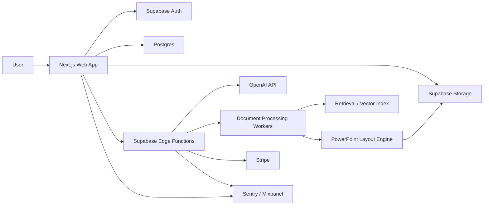

# AuditFlow AI System Architecture

## Product Summary

AuditFlow AI ingests prior-year audit PowerPoint decks, Excel findings, raw notes, PDFs, and other audit evidence, then produces an updated audit committee deck with preserved formatting, refreshed findings pages, executive summary, charts, and editable PowerPoint export.

The product must behave like enterprise workflow software, not a document demo. The core asset is trust: users must see provenance, review AI-generated changes, preserve source formatting, and export editable decks that remain close to the prior-year visual standard.

## Core Principles

1. Preserve PowerPoint structure before generating new content.
2. Keep AI output structured, reviewed, and traceable.
3. Treat every uploaded file as tenant-isolated confidential data.
4. Separate extraction, reasoning, rendering, and export into auditable jobs.
5. Make every generated deck reproducible from inputs, versions, prompts, models, and templates.
6. Build RBAC, billing, audit logs, and observability from the first implementation phase.

## High-Level Architecture

## Application Layers

### Web Application

- Next.js App Router with TypeScript.
- Tailwind and shadcn/ui for interface primitives.
- Server Components for tenant-scoped data reads.
- Server Actions for authenticated mutations where appropriate.
- Route Handlers for webhooks, file upload orchestration, and export download flows.
- Supabase SSR client utilities with cookie-backed sessions.

Although the user requested Next.js 15, current architecture planning should pin to the latest security-patched Next.js 15 release line unless approval is given to move to the current stable Next.js line. Authorization must never rely only on middleware/proxy; every sensitive server path revalidates the user and tenant role.

### Backend

- Supabase Postgres as system of record.
- Supabase Auth for identity and session lifecycle.
- Supabase Storage for original uploads, normalized artifacts, previews, and exports.
- Supabase Edge Functions for webhook handling, orchestration endpoints, signed upload/export actions, and lightweight async control.
- Long-running document work should be designed behind a job interface. If Supabase Edge Function limits are too tight for PPTX/PDF processing, the architecture can add a dedicated worker runtime while preserving Supabase as the system of record.

### AI Layer

- OpenAI Responses API for agentic document analysis and generation.
- Structured Outputs for schema-bound findings, executive summaries, chart specs, deck plans, and validation results.
- Retrieval via vector stores or a tenant-isolated retrieval layer with metadata filters.
- Human review gates before final export.
- Prompt, model, schema, and output versions stored for reproducibility.

OpenAI official docs currently describe file search as a Responses API tool backed by vector stores, and Structured Outputs as JSON Schema-constrained generation. These capabilities shape the AI workflow design.

Sources:

- OpenAI File Search: https://platform.openai.com/docs/guides/tools-file-search/
- OpenAI Retrieval: https://platform.openai.com/docs/guides/retrieval
- OpenAI Structured Outputs: https://platform.openai.com/docs/guides/structured-outputs
- OpenAI Responses API: https://platform.openai.com/docs/api-reference/responses

### Document Processing

Processing is split into deterministic extraction and AI interpretation:

1. Upload intake and file fingerprinting.
2. Virus and file-type validation.
3. PowerPoint parsing into slide layouts, masters, themes, placeholders, text runs, shapes, tables, charts, media, notes, and relationships.
4. Excel parsing into normalized findings tables and chart-ready datasets.
5. PDF parsing into page text, tables, images, and citations.
6. Notes parsing into structured observations.
7. Chunking and indexing for retrieval.
8. AI extraction and synthesis into typed intermediate models.
9. Deck plan generation.
10. PowerPoint rendering using prior-year formatting primitives.
11. Validation diff, preview, and export.

### PowerPoint Preservation Strategy

The critical requirement is handled by a dedicated layout preservation engine:

- Parse prior-year deck as the canonical template.
- Preserve masters, layouts, themes, fonts, colors, margins, bullet styles, chart styles, table styles, and repeated shape groups.
- Build a slide-pattern library from the source deck.
- Classify each slide by role: cover, agenda, executive summary, status overview, findings detail, risk heatmap, chart page, appendix, closing.
- Reuse matched layouts when generating new content.
- Replace only controlled content regions while leaving decorative and branding layers intact.
- Preserve editable PowerPoint objects where possible instead of flattening to images.
- Store a layout confidence score and require review when confidence is below threshold.

Initial library candidates:

- `pptxgenjs` for generating editable PPTX output.
- `JSZip` plus Open XML inspection for preserving and reusing template internals.
- `exceljs` for findings workbook extraction.
- `pdf-parse`, `pdfjs-dist`, or an external extraction worker for PDFs, selected during implementation spike.

## Backend Services

### Auth Service

- Supabase Auth.
- Email/password and SSO-ready structure.
- Tenant resolution from membership, not user metadata.
- Server-side `getUser()` validation for protected paths.

### Organization Service

- Organizations, memberships, roles, invitations, and audit log context.
- Workspace-level settings for branding, data retention, and billing.

### Project Service

- Audit engagement lifecycle.
- Tracks source files, processing jobs, generated artifacts, review states, exports, and approvals.

### Upload Service

- Signed upload flows.
- File validation.
- Storage path isolation by organization and project.
- File fingerprinting for duplicate detection.

### Processing Service

- Job creation and state machine.
- Document extraction tasks.
- AI workflow dispatch.
- Retry and failure handling.
- Durable status updates in Postgres.

### AI Service

- Prompt registry.
- Structured extraction.
- Retrieval orchestration.
- Deck outline generation.
- Findings synthesis.
- Executive summary generation.
- Output validation.

### PowerPoint Service

- Prior-year template analysis.
- Layout role detection.
- Slide content binding.
- Chart/table rendering.
- PPTX export generation.
- Visual and structural validation.

### Billing Service

- Stripe Checkout or customer portal.
- Subscription entitlements.
- Usage tracking for uploads, projects, generated decks, seats, and AI processing.
- Webhook-driven subscription state updates.

### Observability Service

- Sentry for frontend/backend errors.
- Mixpanel for product analytics.
- Structured audit logs in Postgres.
- Job event logs for processing transparency.

