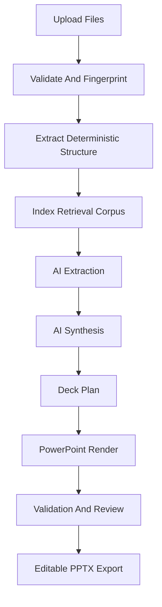

# AI And Document Workflows

## Workflow Overview

## AI Workflows

### Findings Extraction

Inputs:

- Excel findings workbook.
- Raw notes.
- Relevant PDF excerpts.
- Prior-year deck findings pages.

Output schema:

- Finding title.
- Condition.
- Criteria.
- Cause.
- Effect.
- Risk rating.
- Management response.
- Owner.
- Due date.
- Prior-year status.
- Source citations.
- Confidence score.

### Executive Summary Generation

Inputs:

- Normalized findings.
- Prior-year executive summary.
- Current-year notes.
- Audit scope metadata.

Output schema:

- Summary bullets.
- Key changes from prior year.
- Themes.
- Required committee attention.
- Tone and confidence notes.
- Citation references.

### Deck Plan Generation

Inputs:

- Template slide pattern library.
- Extracted findings.
- Executive summary.
- Required output sections.

Output schema:

- Slide sequence.
- Slide roles.
- Layout pattern ids.
- Content bindings.
- Chart specs.
- Review warnings.

### Chart Generation

Inputs:

- Excel findings tables.
- Current/prior-year comparison data.
- Template chart styles.

Output schema:

- Chart type.
- Series.
- Labels.
- Colors.
- Layout region.
- Source range provenance.

### Validation Workflow

Inputs:

- Generated deck plan.
- Rendered PPTX structural model.
- Original template model.

Output schema:

- Missing required slides.
- Layout confidence.
- Text overflow risks.
- Unsupported formatting changes.
- Uncited claims.
- Export blockers.

## Retrieval Design

Retrieval must be tenant-isolated and project-scoped.

Recommended metadata filters:

- `organization_id`
- `project_id`
- `source_file_id`
- `document_type`
- `fiscal_year`
- `section`
- `page_or_slide`

For the MVP, OpenAI vector stores and file search are viable because official docs support PowerPoint and PDF file formats and metadata filtering. If enterprise data residency or zero-data-retention requirements conflict with hosted retrieval, the architecture should switch to a self-managed vector layer while preserving the same retrieval interface.

## Prompt And Schema Versioning

Every AI workflow stores:

- Workflow name.
- Prompt version.
- JSON schema version.
- Model.
- Input hash.
- Output.
- Token/usage metadata.
- Validation result.

No AI output should directly overwrite a deck. It first becomes a typed artifact, then a reviewable deck plan, then a rendered export.

## Human Review Gates

Review is required when:

- Layout confidence is low.
- Source citations are missing for material claims.
- Findings conflict across inputs.
- Text may overflow template placeholders.
- A generated chart changes interpretation from source data.
- The system cannot preserve editable PowerPoint objects.

