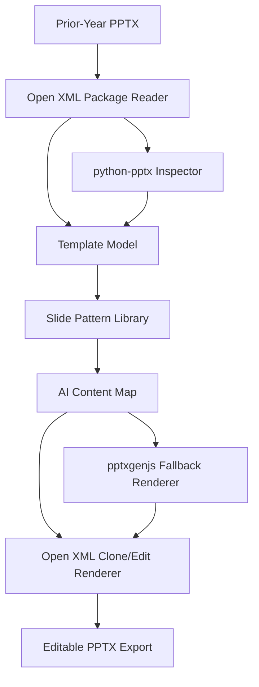

# PowerPoint Preservation Spike Results

## Executive Recommendation

Use a hybrid PowerPoint architecture:

1. Open XML clone/edit as the fidelity-preserving core.
2. `python-pptx` for structural inspection, shape discovery, and limited safe mutations.
3. `pptxgenjs` for generating new editable tables, charts, and slides when no suitable prior-year slide pattern exists.

Do not use `pptxgenjs` alone as the preservation engine. It is useful for creation, but it does not parse and preserve prior-year deck masters, layouts, and placeholders as a template source. Do not use `python-pptx` alone as the preservation engine either; it can inspect and mutate, but round-tripping can drop unsupported package parts.

## Benchmark Inputs

The spike generated a representative prior-year audit committee deck with:

- 3 slides.
- 1 slide master.
- 11 slide layouts.
- 1 theme.
- 3 speaker-note parts.
- 1 editable table.
- 1 editable chart.
- 23 editable text runs.
- 5 placeholders.

Fixture:

- `tools/pptx-spike/fixtures/prior_year_audit_committee.pptx`

## Benchmark Results

| Approach | Score | Masters | Layouts | Themes | Notes | Tables | Charts | Editable Text Runs | Timing |
| --- | ---: | ---: | ---: | ---: | ---: | ---: | ---: | ---: | ---: |
| `python-pptx` round-trip | 7/8 | 1 | 11 | 1 | 0 | 1 | 1 | 23 | 10.24 ms |
| `pptxgenjs` regeneration | 7/8 | 1 | 1 | 1 | 3 | 1 | 1 | 23 | 950.26 ms |
| Hybrid Open XML clone/edit | 8/8 | 1 | 11 | 1 | 3 | 1 | 1 | 23 | 6.39 ms |

Raw benchmark output:

- `tools/pptx-spike/out/benchmark-results.json`
- `tools/pptx-spike/out/benchmark-summary.md`

Generated comparison decks:

- `tools/pptx-spike/out/python_pptx_roundtrip.pptx`
- `tools/pptx-spike/out/pptxgenjs_regenerated.pptx`
- `tools/pptx-spike/out/hybrid_openxml_clone_edit.pptx`

## Tool Findings

### `pptxgenjs`

Strengths:

- Generates editable PPTX slides.
- Can create tables and charts.
- Can create speaker notes.
- Works well for net-new slides that do not need exact source-template fidelity.

Weaknesses:

- Does not parse existing PPTX files as source templates.
- Regenerated deck had only 1 layout versus 11 in the source.
- Placeholder structure was not preserved.
- Styling must be reconstructed manually or from extracted design tokens.
- Slower in the local benchmark because it fully creates a new deck.

Best use:

- Fallback renderer for new editable chart/table slides.
- Creating net-new generated slides after we have extracted theme/style tokens.

### `python-pptx`

Strengths:

- Reads slide count, layouts, masters, shapes, text, tables, and charts.
- Mutates editable text in existing decks.
- Preserves charts and tables in the tested fixture.
- Good developer ergonomics for extraction.

Weaknesses:

- Round-trip dropped speaker-note parts in the benchmark.
- Does not expose all Open XML package details.
- Risky as the sole preservation layer for enterprise templates with uncommon PowerPoint constructs.

Best use:

- Layout and shape inspection.
- Extracting candidate text regions, placeholders, table metadata, and chart presence.
- Conservative mutation where unsupported parts are not at risk.

### Hybrid Open XML Clone/Edit

Strengths:

- Preserved all measured source package structures.
- Kept masters, layouts, theme, notes, table, chart, placeholders, and editable text.
- Fastest benchmark path.
- Best fit for prior-year template preservation because it starts from the actual user deck.

Weaknesses:

- Requires careful Open XML engineering.
- Text replacement must preserve run-level styling and avoid corrupting relationships.
- Chart/table data updates require specialized handlers.
- Slide insertion and duplication need robust relationship id management.

Best use:

- Core preservation engine.
- Clone selected prior-year slide patterns.
- Replace targeted text/table/chart data while leaving branding and layout XML intact.

## Recommended MVP Architecture

## Implementation Recommendation

Build `packages/pptx` around these modules:

- `package-reader`: ZIP/Open XML reader.
- `template-analyzer`: masters, layouts, theme, slide dimensions, placeholders, notes, charts, tables.
- `slide-classifier`: maps prior-year slides to semantic roles.
- `content-map`: typed AI output describing replacements and generated slide intents.
- `xml-clone-renderer`: clones slides and applies safe text/table/chart edits.
- `pptxgen-fallback-renderer`: generates editable net-new slides when no source slide fits.
- `validator`: verifies package integrity and preservation metrics.

## MVP Decision

The MVP should start with Open XML clone/edit for:

- Replacing title, summary, and finding body text.
- Preserving notes, masters, layouts, themes, and placeholders.
- Reusing prior-year finding slides.

Then add targeted handlers in this order:

1. Text replacement with run-style preservation.
2. Table cell replacement.
3. Chart data replacement.
4. Slide duplication with relationship remapping.
5. New-slide fallback via `pptxgenjs`.

## Known Blockers And Follow-Ups

- Need tests against real customer-like enterprise decks, not only generated fixtures.
- Need Microsoft PowerPoint desktop validation for final fidelity; ZIP-level validation is necessary but not sufficient.
- Need chart data replacement spike against embedded workbook parts.
- Need relationship remapping tests for duplicated slides with images, charts, notes, and embedded media.
- Local environment has no `git` executable available, so no commit was created.

