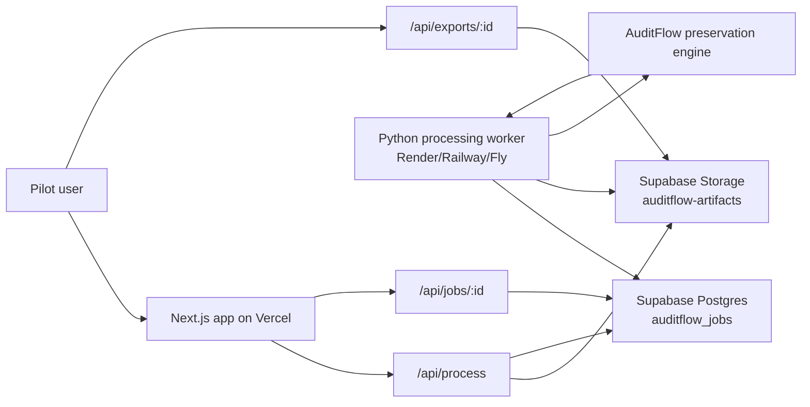

# Pilot Processing Architecture

## Recommendation

Use Supabase Postgres + Supabase Storage + a small Python background worker.

This is the minimum pilot-ready architecture that supports real users uploading decks and receiving generated outputs without depending on local machine execution.

## Architecture Diagram

## Storage Evaluation

### Supabase Storage

Recommended.

Why:

- Same platform provides both job database and private file storage.
- Storage supports file buckets, access controls, CDN, REST API, and S3-compatible access.
- Private buckets work well for audit decks and generated artifacts.
- Pricing is pilot-friendly: Free includes 1 GB file storage; Pro includes 100 GB file storage, according to Supabase pricing docs.

Tradeoff:

- Requires a Supabase project and service-role key for server/worker operations.

### Vercel Blob

Good storage product, but not selected for this pilot.

Why not:

- It solves files, but not durable job lifecycle state by itself.
- We would still need a database or queue.
- It keeps storage and job state split across services.

### Cloudinary

Not selected.

Why not:

- Excellent for images/video transformations.
- PPTX/XLSX artifacts are generic private files, not media assets needing transformations.

### Other Lightweight Options

S3/R2 are viable later, but they require pairing with a separate database and more setup. Supabase keeps the pilot stack smaller.

## Worker Evaluation

### Supabase Edge Functions

Not selected.

Reason:

- Supabase Edge Functions are TypeScript/Deno-first and optimized for short-lived edge tasks.
- The preservation engine is Python and needs PPTX/document libraries.

### Vercel Functions

Not selected for processing.

Reason:

- Vercel can run Python Functions and currently supports Python 3.12, 3.13, and 3.14.
- Long-running PPTX generation and file processing are better handled by a worker for pilot reliability.
- The Next.js app can remain on Vercel while processing runs elsewhere.

### Background Worker / Container Service

Recommended.

Why:

- Supports Python directly.
- Can run longer than a web request.
- Easy to deploy on Render, Railway, Fly.io, or a small VM.
- Keeps processing async and retryable.
- Lets the preservation engine remain unchanged.

## Job Lifecycle

The `auditflow_jobs` table tracks:

- `queued`
- `processing`
- `completed`
- `failed`

Flow:

1. User uploads files in the web app.
2. `/api/process` uploads files to Supabase Storage.
3. `/api/process` creates a queued row in `auditflow_jobs`.
4. UI polls `/api/jobs/:id`.
5. Python worker claims queued job and marks it processing.
6. Worker downloads files, runs the preservation workflow, uploads output artifacts, and marks job completed.
7. User downloads PPTX/report/manifest via `/api/exports/:id`.

## Required Environment Variables

Vercel:

- `NEXT_PUBLIC_APP_ENV=preview`
- `AUDITFLOW_PROCESSOR_MODE=supabase`
- `SUPABASE_URL`
- `SUPABASE_SERVICE_ROLE_KEY`
- `AUDITFLOW_STORAGE_BUCKET=auditflow-artifacts`

Python worker:

- `SUPABASE_URL`
- `SUPABASE_SERVICE_ROLE_KEY`
- `AUDITFLOW_STORAGE_BUCKET=auditflow-artifacts`

Optional future variables:

- `OPENAI_API_KEY`
- `SENTRY_DSN`

## Deployment Checklist

Supabase:

- Create Supabase project.
- Apply migration `supabase/migrations/20260603000000_pilot_processing.sql`.
- Confirm private bucket `auditflow-artifacts` exists.
- Confirm `auditflow_jobs` table exists.
- Keep `SUPABASE_SERVICE_ROLE_KEY` server-side only.

Vercel:

- Project root: `apps/web`.
- Build command: `npm run build`.
- Set Vercel env vars listed above.
- Deploy preview.
- Submit a small PPTX/XLSX upload.
- Confirm job enters `queued`.

Worker:

- Deploy worker as an always-on Python service.
- Install `requirements.txt`.
- Set worker env vars.
- Start `python tools/worker/run_supabase_worker.py`.
- Confirm job moves `queued -> processing -> completed`.

Validation:

- Download editable PPTX.
- Download report JSON.
- Download manifest JSON.
- Confirm preservation score and package validity.

## Estimated Monthly Cost

Pilot estimate:

- Vercel Pro: about `$20/month` if using Pro; Hobby may work for early non-commercial testing.
- Supabase Free: `$0/month` if within free limits; Supabase Pro is listed from `$25/month`.
- Small worker host: approximately `$5-$10/month` on a lightweight container host.
- OpenAI: `$0` for current deterministic workflow; usage-based once AI mapping is enabled.

Expected pilot range: `$5-$55/month` before AI usage and overages.

## Pilot-Scale Limits

Recommended pilot limits:

- Max upload size: 50 MB per file.
- Max concurrent processing jobs: 1 worker initially.
- Target deck size: 10-60 slides.
- Target pilot volume: 10-50 jobs/month.
- Retention: manually delete artifacts after pilot review or set a 7-30 day retention policy later.

Known limits:

- No auth yet, so preview URL should be shared only with trusted pilot testers.
- No retry queue yet; failed jobs can be manually re-uploaded.
- No automatic artifact retention cleanup yet.
- No multi-worker locking beyond simple status transitions; keep one worker for pilot.
